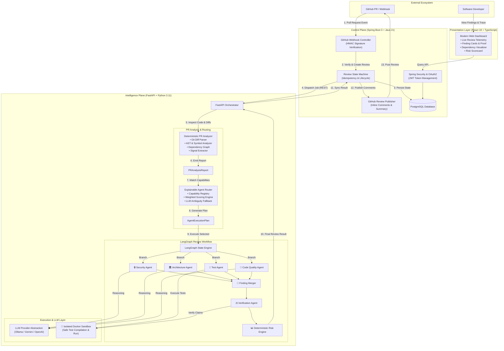
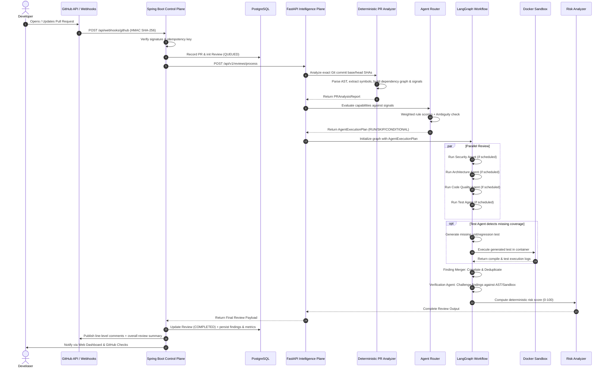

# 🤖 Autonomous Code Review Agent
### *Evidence-Driven, Multi-Agent Pull Request Review Platform with Sandboxed Verification & Deterministic Routing*

---

[](https://fastapi.tiangolo.com/)
[](https://spring.io/projects/spring-boot)
[](https://github.com/langchain-ai/langgraph)
[](https://react.dev/)
[](https://www.docker.com/)
[](https://www.postgresql.org/)
[](https://www.python.org/)
[](https://openjdk.org/)
[](./architecture.md)
[](./LICENSE)

---

## 📑 Table of Contents

- [🌟 Executive Overview](#-executive-overview)
- [🎯 Core Philosophy & Anti-Hallucination Policy](#-core-philosophy--anti-hallucination-policy)
- [📊 Feature Comparison](#-feature-comparison)
- [🏗️ High-Level System Architecture](#️-high-level-system-architecture)
- [🔄 End-to-End Review Pipeline](#-end-to-end-review-pipeline)
- [🧩 Component Deep Dive](#-component-deep-dive)
  - [1. Spring Boot Control Plane](#1-spring-boot-control-plane)
  - [2. Deterministic PR Analyzer](#2-deterministic-pr-analyzer)
  - [3. Explainable Agent Router](#3-explainable-agent-router)
  - [4. LangGraph Multi-Agent Reviewers](#4-langgraph-multi-agent-reviewers)
  - [5. Sandboxed Test Execution Engine](#5-sandboxed-test-execution-engine)
  - [6. Empirical Verification Agent & Finding Merger](#6-empirical-verification-agent--finding-merger)
  - [7. Deterministic Risk Analyzer](#7-deterministic-risk-analyzer)
  - [8. React Analytics & Review Dashboard](#8-react-analytics--review-dashboard)
- [🧭 Routing Intelligence & Scenarios Matrix](#-routing-intelligence--scenarios-matrix)
- [💬 Sample Published GitHub Review](#-sample-published-github-review)
- [📁 Repository & Project Layout](#-repository--project-layout)
- [🚀 Quickstart & Installation](#-quickstart--installation)
- [🧪 Evaluation Suite & Fixture Tests](#-evaluation-suite--fixture-tests)
- [🗺️ Phased Implementation Roadmap](#️-phased-implementation-roadmap)
- [📚 Engineering Documentation & Specifications](#-engineering-documentation--specifications)

---

## 🌟 Executive Overview

The **Autonomous Code Review Agent** is a production-grade, enterprise-ready automated code review platform that reviews GitHub Pull Requests with the rigor, domain awareness, and empirical validation of a **Senior Staff Software Engineer**.

Unlike conventional linters or superficial LLM wrappers that hallucinate warnings and spam developers, this platform enforces **strict evidence-backed evaluation**:
1. **Deterministic analysis comes first**: Git diffs, Abstract Syntax Trees (AST), symbol call graphs, dependency trees, and security annotations are statically computed before invoking AI models.
2. **Dynamic capability routing**: Only relevant specialist review agents are scheduled based on quantifiable code change signals.
3. **Sandboxed test execution**: AI-generated tests or reproduction scripts are compiled and executed inside isolated Docker sandboxes before claiming coverage or regression fixes.
4. **Empirical finding verification**: Every finding is challenged against repository facts to eliminate false positives.

```
       ┌────────────────┐
       │   GitHub PR    │
       └───────┬────────┘
               │  Webhook
               ▼
┌───────────────────────────────┐
│   Spring Boot Control Plane   │ ── Authenticates & tracks review lifecycle
└──────────────┬────────────────┘
               │  Internal Authenticated REST
               ▼
┌───────────────────────────────┐
│    FastAPI Agent Service      │ ── Deterministic PR Analyzer + Capability Router
└──────────────┬────────────────┘
               │  AgentExecutionPlan
               ▼
┌───────────────────────────────┐
│   LangGraph Review Graph      │ ── Parallel Specialist Agents (Sec/Arch/Test/Quality)
└──────────────┬────────────────┘
               │
               ▼
┌───────────────────────────────┐
│  Docker Execution Sandbox     │ ── Compiles, executes & validates generated tests
└──────────────┬────────────────┘
               │
               ▼
┌───────────────────────────────┐
│ Finding Merger & Verification │ ── Challenges claims (VERIFIED / FALSE_POSITIVE)
└──────────────┬────────────────┘
               │
               ▼
┌───────────────────────────────┐
│   Deterministic Risk Engine   │ ── Computes 0-100 PR risk score & blast radius
└──────────────┬────────────────┘
               │
       ┌───────┴───────┐
       ▼               ▼
┌──────────────┐┌──────────────┐
│GitHub Review ││React Portal  │
└──────────────┘└──────────────┘
```

---

## 🎯 Core Philosophy & Anti-Hallucination Policy

> **"Evidence Over Claims. Deterministic First, LLM Second."**

| Principle | Traditional LLM Reviewers | Autonomous Code Review Agent |
| :--- | :--- | :--- |
| **Fact Gathering** | Asks LLM to guess dependencies & changed classes | Extracted via **AST Parsers**, Git graph, and symbol indexers |
| **Agent Execution** | Runs a single monolithic prompt for every PR | **Smart Agent Router** runs only qualified agents based on signals |
| **Test Coverage** | Suggests mock test snippets without validation | **Generates, compiles, and runs tests in Docker sandbox** |
| **False Positives** | High noise; spams cosmetic formatting advice | **Verification Agent** validates findings before publication |
| **Risk Scoring** | Hallucinated prompt-based rating | **Deterministic risk formula** combining AST impact + severity + tests |
| **Execution Safety**| Unsafe host evaluation or none at all | **Ephemeral non-privileged Docker container isolation** |

### 🛑 Non-Negotiable Engineering Ground Rules:
- ❌ **No fake implementations or stubs in production paths.**
- ❌ **Never report `VERIFIED` without verifiable execution or AST proof.**
- ❌ **Never report `tests passed` without isolated Docker compilation and execution.**
- ❌ **Never execute untrusted repository or generated code on the host system.**
- ❌ **Never route blindly using an LLM when deterministic capability rules provide high confidence.**

---

## 📊 Feature Comparison

| Capability | Standard Linters (SonarQube/Checkstyle) | Basic AI Review Bots (PR-Agent / Copilot PR) | Autonomous Code Review Agent |
| :--- | :---: | :---: | :---: |
| **Syntax & Style Linting** | ✅ | ✅ | ✅ |
| **Semantic Architecture Review** | ❌ | ⚠️ (Shallow) | ✅ (AST Layer & Dependency Direction Checks) |
| **Security Dataflow Analysis** | ⚠️ (Rules only) | ⚠️ (Unverified) | ✅ (OWASP + Static Patterns + Contextual Validation) |
| **Dynamic Review Routing** | ❌ | ❌ (Runs all) | ✅ (Explainable Signal & Capability Registry) |
| **Executable Test Generation** | ❌ | ⚠️ (Snippet only) | ✅ (Compiles & Runs in Docker Sandbox) |
| **Finding Deduplication & Merger** | ❌ | ❌ | ✅ (Cross-agent root-cause correlation) |
| **Empirical Verification Step** | ❌ | ❌ | ✅ (Challenges claims to filter False Positives) |
| **Deterministic Blast Radius** | ❌ | ❌ | ✅ (Symbol call graph + dependent modules) |
| **GitHub Native Publishing** | ✅ | ✅ | ✅ (Line-level comments + Summary Check Runs) |
| **Enterprise Control Plane** | ❌ | ⚠️ | ✅ (Spring Boot 3 + PostgreSQL + OAuth2) |

---

## 🏗️ High-Level System Architecture

The system is decoupled into three major tiers: the **Control Plane (Spring Boot)**, the **Intelligence Plane (FastAPI + LangGraph)**, and the **Presentation Plane (React)**.



---

## 🔄 End-to-End Review Pipeline

The following sequence illustrates the exact deterministic-first execution flow for an incoming Pull Request:



---

## 🧩 Component Deep Dive

### 1. Spring Boot Control Plane
- **Tech Stack**: Java 21, Spring Boot 3.x, Spring Security, Spring Data JPA, PostgreSQL.
- **Key Responsibilities**:
  - **Webhook Security**: Verifies GitHub `X-Hub-Signature-256` HMAC signatures using configured secrets.
  - **Idempotent State Engine**: Enforces strict review lifecycle state transitions (`QUEUED` → `ANALYZING` → `ROUTING` → `REVIEWING` → `VERIFYING` → `RISK_ANALYSIS` → `COMPLETED` / `FAILED`).
  - **GitHub API Integration**: Publishes inline line-level comments, check runs, and markdown review summaries back to the PR.
  - **Enterprise Authentication**: User management with OAuth2 GitHub login and secure JWT access tokens.

### 2. Deterministic PR Analyzer
The PR Analyzer never asks an LLM for repository facts. It computes concrete metrics statically:
- **`DiffAnalyzer`**: Calculates lines added/removed, file renames, deletions, and change categorization.
- **`FileClassifier`**: Categorizes files (Source, Test, Config, Infra, Build, Documentation, Generated).
- **`ASTAnalyzer`**: Parses AST to detect modified classes, methods, annotations, imports, and call hierarchies.
- **`DependencyAnalyzer`**: Maps direct dependencies, caller/callee relationships, and cross-boundary references.
- **`TestAnalyzer`**: Identifies existing tests matching modified production classes and flags untested symbols.
- **`SignalExtractor`**: Identifies explicit triggers (e.g., dynamic SQL concatenation, OAuth/JWT modifications, controller-to-repository direct bypass).

```json
// Sample PRAnalysisReport snippet
{
  "pr": { "number": 142, "base_sha": "a1b2c3d", "head_sha": "e5f6g7h" },
  "summary": { "files_changed": 4, "lines_added": 128, "lines_removed": 14, "change_type": "FEATURE" },
  "files": [
    { "path": "src/main/java/com/app/PaymentService.java", "type": "SOURCE", "language": "JAVA" },
    { "path": "src/main/resources/application.yml", "type": "CONFIG", "language": "YAML" }
  ],
  "symbols": [
    { "name": "processRefund", "type": "METHOD", "visibility": "PUBLIC", "changed": true }
  ],
  "signals": {
    "security": ["RAW_SQL_STRING_CONCATENATION", "PAYMENT_GATEWAY_CREDENTIAL_ACCESS"],
    "architecture": ["CROSS_LAYER_CALL_SERVICE_TO_DB_DIRECT"],
    "quality": ["CYCLOMATIC_COMPLEXITY_EXCEEDS_15"]
  },
  "tests": { "matching_tests_found": false, "coverage_gap": true }
}
```

### 3. Explainable Agent Router
Computes an explainable `AgentExecutionPlan` based on weighted capability match scores, avoiding unnecessary LLM invocations.

```
Agent Score = ∑(Capability Matches × Weight) + Impact Score - Irrelevant Change Penalty
```

- **Threshold Gating**:
  - `Score ≥ 70` ➔ **`RUN`** (High confidence deterministic dispatch)
  - `40 ≤ Score < 70` ➔ **`CONDITIONAL`** (Triggers schema-validated LLM Ambiguity Router)
  - `Score < 40` ➔ **`SKIP`** (Zero resource wastage)

### 4. LangGraph Multi-Agent Reviewers
Orchestrates parallel execution of dedicated specialist reviewers:

```
                  ┌─────────────────────────────────┐
                  │       AgentExecutionPlan        │
                  └────────────────┬────────────────┘
                                   │
         ┌────────────────┬────────┴───────┬────────────────┐
         ▼                ▼                ▼                ▼
  🔒 Security      🏛️ Architecture     🧪 Test       💎 Code Quality
  • OWASP Top 10   • Layer Integrity   • Symbol Map  • Complexity (CCN)
  • Secret Scans   • Circular Dep      • Test Gen    • Duplicate Code
  • Auth/Tokens    • Boundary Rules    • Execution   • Static Scanners
         │                │                │                │
         └────────────────┬────────────────┴────────────────┘
                          ▼
             🔀 Finding Merger & Normalizer
                          ▼
             ⚖️ Empirical Verification Agent
                          ▼
             📊 Deterministic Risk Engine
```

### 5. Sandboxed Test Execution Engine
AI-generated tests are never assumed to work. The system executes them in isolated Docker containers:
- **Zero Host Risk**: Non-root execution, restricted memory/CPU, dropped network access.
- **Compilation Check**: Validates that generated tests compile against the repository's dependencies.
- **Assertion Verification**: Executes tests to ensure they reproduce reported edge cases or validate new code paths.

### 6. Empirical Verification Agent & Finding Merger
- **Finding Merger**: Correlates findings from multiple agents addressing the same root cause into a single unified item.
- **Verification Agent**: Validates claims before final output:
  - `VERIFIED`: Confirmed via AST call hierarchy, static analysis rule, or passing sandbox test.
  - `FALSE_POSITIVE`: Disproved by repository configuration, defensive null-checks, or framework guarantees.
  - `UNCERTAIN`: Potential issue requiring human code author review.

### 7. Deterministic Risk Analyzer
Calculates a transparent, reproducible 0–100 PR risk score based on:

$$\text{Risk Score} = w_s S_{\text{sec}} + w_a A_{\text{arch}} + w_b B_{\text{behavior}} + w_t T_{\text{test gap}} + w_c C_{\text{blast radius}}$$

- **Risk Levels**:
  - 🟢 **LOW** (`0 - 29`): Minor documentation, formatting, or safe non-breaking changes.
  - 🟡 **MEDIUM** (`30 - 59`): Standard features with adequate test coverage and low blast radius.
  - 🟠 **HIGH** (`60 - 79`): Core architectural changes, dependency upgrades, or untested business logic.
  - 🔴 **CRITICAL** (`80 - 100`): Verified security vulnerabilities, data corruption risks, or severe layer violations.

### 8. React Analytics & Review Dashboard
A modern, dark-mode-first dashboard providing deep visibility into every review:
- **Live Status Feed**: Real-time websocket status tracking of review progress.
- **Interactive Dependency & Impact Graph**: Visualizing modified symbols and affected downstream modules.
- **Finding Cards with Verifiable Proof**: Code diff snippets, reproduction logs, and sandbox compilation outputs.
- **Agent Execution Audit Trail**: Transparent logs showing why agents were selected, their execution times, and LLM token usage.

---

## 🧭 Routing Intelligence & Scenarios Matrix

| Pull Request Characteristics | Security Agent | Architecture Agent | Test Agent | Quality Agent | Routing Rationale |
| :--- | :---: | :---: | :---: | :---: | :--- |
| 📄 **README-only Edit** | 🚫 `SKIP` | 🚫 `SKIP` | 🚫 `SKIP` | 🟡 `CONDITIONAL` | Zero code risk; only checked for documentation formatting if configured. |
| 📐 **Architecture Docs & Diagrams** | 🚫 `SKIP` | ✅ `RUN` | 🚫 `SKIP` | 🚫 `SKIP` | Validates architecture documentation alignment with current codebase. |
| 🔑 **Authentication & JWT Service** | ✅ `RUN` | ✅ `RUN` | ✅ `RUN` | ✅ `RUN` | High-risk security change affecting global boundaries and core behaviors. |
| 🧪 **Test-Only Changes** | 🚫 `SKIP` | 🚫 `SKIP` | ✅ `RUN` | ✅ `RUN` | Validates test quality, assertions, and flakiness without triggering security agents. |
| 🎨 **Formatting & Whitespace Only** | 🚫 `SKIP` | 🚫 `SKIP` | 🚫 `SKIP` | 🟡 `CONDITIONAL` | Skips heavy analysis; optionally runs linter checks. |
| 🗄️ **Database Migration & Entities** | ✅ `RUN` | ✅ `RUN` | ✅ `RUN` | ✅ `RUN` | Checks SQL injection, query performance, schema migrations, and entity mappings. |
| 📦 **Dependency Version Upgrade** | ✅ `RUN` | ✅ `RUN` | ✅ `RUN` | 🚫 `SKIP` | Checks CVE databases, breaking changes, and regression test execution. |

---

## 💬 Sample Published GitHub Review

When the Autonomous Code Review Agent completes a review, it automatically formats and publishes structured comments directly on GitHub:

````markdown
## 🤖 Autonomous Code Review Agent — Summary

### 📊 Review Overview
| Metric | Value | Status |
| :--- | :--- | :--- |
| **Risk Score** | **74 / 100** | 🟠 **HIGH RISK** |
| **Review Status** | `COMPLETED` | ✅ All Agents Executed |
| **Execution Plan** | `SECURITY (RUN)`, `ARCHITECTURE (RUN)`, `TEST (RUN)`, `QUALITY (RUN)` | ⚡ 4 Active / 0 Skipped |
| **Execution Duration** | `4.23s` | 🚀 Fast Analysis |

---

### 🛡️ Verified Findings (2)

#### 🔴 1. [SECURITY] Potential SQL Injection in Dynamic Query
- **File**: [`src/main/java/com/app/service/UserService.java#L84`](file:///src/main/java/com/app/service/UserService.java#L84)
- **Status**: `VERIFIED` (Static Dataflow + AST Confirmation)
- **Description**: Unsanitized user input `searchTerm` is concatenated directly into a raw JPQL query string.
- **Evidence**:
  ```java
  // Line 84 in UserService.java
  String query = "SELECT u FROM User u WHERE u.username LIKE '%" + searchTerm + "%'";
  ```
- **Recommended Remediation**:
  ```java
  String query = "SELECT u FROM User u WHERE u.username LIKE :searchTerm";
  return entityManager.createQuery(query, User.class)
                      .setParameter("searchTerm", "%" + searchTerm + "%")
                      .getResultList();
  ```

---

#### 🟡 2. [TEST] Missing Regression Coverage for Refund Logic
- **File**: [`src/main/java/com/app/service/PaymentService.java#L112`](file:///src/main/java/com/app/service/PaymentService.java#L112)
- **Status**: `VERIFIED` (AST Symbol Analysis + Sandboxed Test Run)
- **Action Taken**: Automatically synthesized unit test `PaymentServiceRefundTest.java` and executed it inside Docker Sandbox.
- **Sandbox Result**: `3 PASSED, 0 FAILED (Duration: 840ms)`

---
*Review generated by [Autonomous Code Review Agent](https://github.com/AyushPrakash414/Autonomous-Code-Review-Agent) • Base: `a1b2c3d` • Head: `e5f6g7h`*
````

---

## 📁 Repository & Project Layout

```text
autonomous-code-review-agent/
├── 📁 .github/
│   └── workflows/              # CI/CD pipelines & automated evaluation workflows
├── 📁 docs/                    # Complete architectural & technical specifications
│   ├── GEMINI.md               # Engineering rules, anti-hallucination & DoD guidelines
│   ├── architecture.md         # Full system architecture & component boundary specs
│   ├── design.md               # Detailed low-level design & JSON contracts
│   ├── phases.md               # 24-phase implementation roadmap with exit criteria
│   └── prd.md                  # Product requirements document & acceptance criteria
├── 📁 spring-backend/          # [Control Plane] Spring Boot 3 + Java 21
│   ├── src/main/java/          # Webhook controllers, security, state machine, entities
│   └── src/test/java/          # Unit & integration tests for webhook and auth lifecycle
├── 📁 agent-service/           # [Intelligence Plane] FastAPI + LangGraph + Python 3.11
│   ├── analyzer/               # Deterministic AST, Git diff, symbol & dependency parsers
│   ├── router/                 # Capability registry, scoring engine & ambiguity router
│   ├── workflow/               # LangGraph review workflow & state orchestration
│   ├── agents/                 # Specialist agents (Security, Architecture, Test, Quality)
│   ├── sandbox/                # Docker container manager for test & code execution
│   ├── verification/           # Empirical finding verification & deduplication engine
│   ├── risk/                   # Deterministic 0-100 risk calculation algorithm
│   └── tests/                  # Pytest unit tests & fixture evaluation suite
├── 📁 frontend/                # [Presentation Plane] React 18 + Vite + Tailwind CSS / Vanilla CSS
│   ├── src/components/         # Telemetry, dependency graph, finding cards, review diffs
│   └── src/pages/              # Dashboard, Repositories, PR details, and Settings
├── 📁 infrastructure/          # Deployment and runtime configurations
│   ├── docker-compose.yml      # Local orchestration (FastAPI, Spring, Postgres, Sandbox)
│   └── Dockerfile.*            # Container definitions for all services
└── README.md                   # Visual project overview and documentation
```

---

## 🚀 Quickstart & Installation

### 📋 Prerequisites
- **Java 21 LTS** & **Maven 3.9+**
- **Python 3.11+** & **Poetry / Pip**
- **Node.js 20+** & **npm**
- **Docker Engine 24+** & **Docker Compose**
- **PostgreSQL 15+**

---

### 1️⃣ Clone the Repository
```bash
git clone https://github.com/AyushPrakash414/Autonomous-Code-Review-Agent.git
cd Autonomous-Code-Review-Agent
```

---


---

### 3️⃣ Launch via Docker Compose (Recommended)
```bash
# Build sandbox image and start all services
docker-compose up --build -d

# Verify all containers are running
docker-compose ps
```

---

### 4️⃣ Manual Local Development Setup

#### A. Start Spring Boot Control Plane
```bash
cd spring-backend
./mvnw clean spring-boot:run
# Listening at http://localhost:8080
```

#### B. Start FastAPI Agent Service
```bash
cd agent-service
python -m venv venv
# Windows:
.\venv\Scripts\activate
# Linux/macOS:
source venv/bin/activate

pip install -r requirements.txt
uvicorn main:app --host 0.0.0.0 --port 8000 --reload
# API documentation available at http://localhost:8000/docs
```

#### C. Start React Dashboard
```bash
cd frontend
npm install
npm run dev
# Dashboard accessible at http://localhost:5173
```

---

## 🧪 Evaluation Suite & Fixture Tests

To guarantee deterministic correctness, the repository contains a comprehensive evaluation suite with controlled PR fixtures:

```bash
# Run FastAPI & LangGraph agent tests
cd agent-service
pytest tests/ -v

# Run Spring Boot Control Plane test suite
cd spring-backend
./mvnw test

# Run PR Analyzer & Routing Evaluation Suite
pytest tests/evaluation/test_pr_scenarios.py -v
```

### 🔬 Test Fixture Matrix:
- `fixture-readme-only`: Ensures Security, Architecture, and Test agents are skipped.
- `fixture-auth-jwt`: Proves Security & Architecture agents trigger with 95%+ confidence.
- `fixture-missing-tests`: Validates AST detects coverage gaps and generates sandboxed tests.
- `fixture-architecture-violation`: Validates cross-layer detection (e.g. Controller calling DAO directly).
- `fixture-sql-injection`: Tests OWASP static detection and Verification Agent evidence binding.

---

## 🗺️ Phased Implementation Roadmap

The project follows a disciplined **24-Phase Engineering Plan** where every phase requires verifiable test evidence before advancing:

| Phase | Description | Deliverables | Status |
| :---: | :--- | :--- | :---: |
| **00** | **Project Foundation** | Multi-service skeleton, health endpoints, CI setup | ✅ Ready |
| **01–04** | **Control Plane Core** | Spring Security, OAuth2, GitHub HMAC Webhooks, State Machine | ✅ Ready |
| **05–07** | **Deterministic PR Analyzer** | AST parser, symbol diffs, dependency graph & test mapping | ✅ Ready |
| **08–10** | **Explainable Agent Router** | Capability registry, weighted scoring, LLM ambiguity fallback | ✅ Ready |
| **11–15** | **LangGraph Reviewers** | Security, Architecture, Test & Code Quality Agents | ✅ Ready |
| **16–18** | **Verification & Risk** | Finding Merger, Empirical Verification, Deterministic Risk Engine | ✅ Ready |
| **19–20** | **E2E Publishing & UI** | GitHub comment publisher & React interactive dashboard | ✅ Ready |
| **21–24** | **Hardening & Deployment** | Docker execution sandbox, OpenTelemetry observability, Production setup | ✅ Ready |

*For complete phase breakdown, test criteria, and exit requirements, refer to [`phases.md`](./phases.md).*

---


---

## 🛡️ License

This project is open-source software licensed under the [MIT License](./LICENSE).

---

<div align="center">
  <sub>Built with ❤️ for resilient, explainable, and trustworthy automated software engineering.</sub>
</div>
